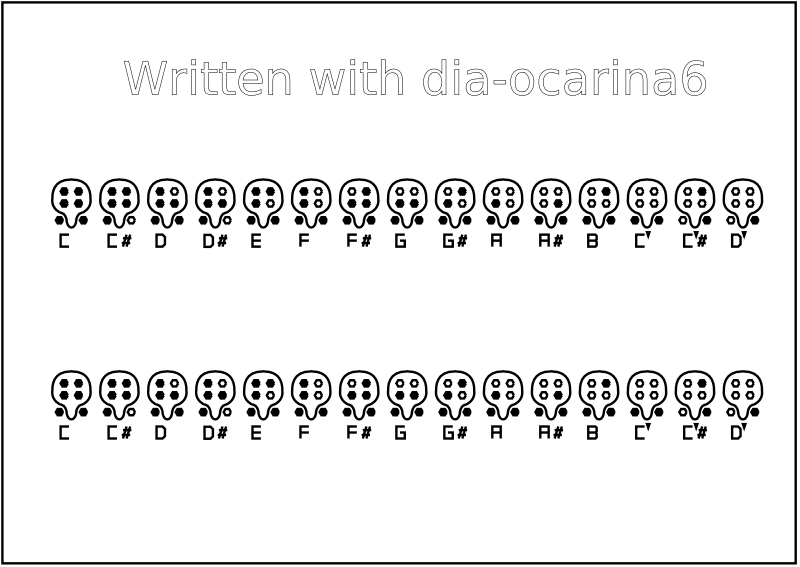

# Dia-Shapes for 6-hole ocarina tabs

## Manual install/uninstall shapes in the Dia directory

### Install
Manual installation of the package in Dia. Installation is done in the `~/.dia` directory.

    make shapes
    make install

### Uninstall
To uninstall, use:

    make uninstall

Uninstallation is done in the `~/.dia` directory.

### Clean
Finally, if desired, delete the *.shape and *.png files.

    make clean

## Create a release

### Compressed file
Creates a file at `dist/dia-*-VERSION.tar.gz` where `VERSION` is the current version of the project.

    make dist

### DEB file
Creates a file in `deb/dia-*-VERSION_all.deb` where `VERSION` is the current version of the project.

    make deb
